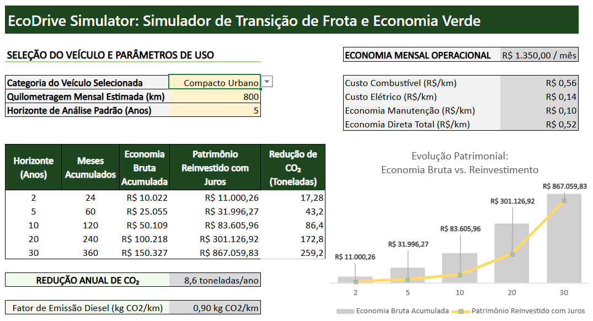
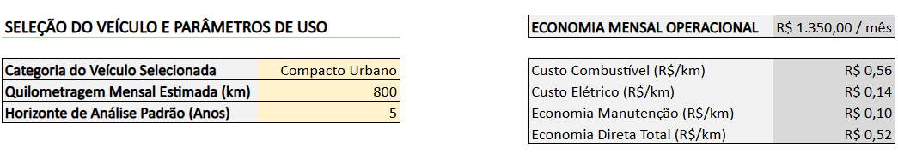
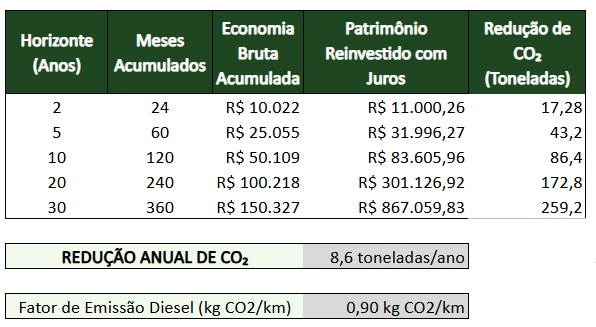
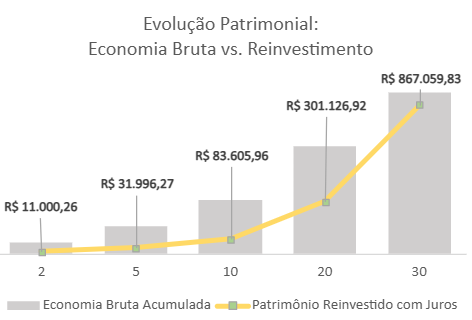

# 🍃 EcoDrive Simulator — Simulador de Transição de Frota e Economia Verde

> **Desafio de Projeto — DIO (Digital Innovation One)**  
> **Bootcamp:** Santander - Excel com IA e Claude  
> **Projeto:** EcoDrive Simulator  

---

## 📌 Apresentação do Projeto

O **EcoDrive Simulator** é uma ferramenta analítica e prática desenvolvida em Microsoft Excel para dar suporte à tomada de decisão executiva em finanças corporativas e ESG. 

Desenvolvido como entrega do Desafio de Projeto no **Bootcamp Santander - Excel com IA e Claude** da **DIO**, o modelo simula os impactos financeiros e ambientais da migração de frotas comerciais a combustão para veículos elétricos, demonstrando como a economia operacional gerada pode ser otimizada através do reinvestimento em renda fixa a juros compostos.

---

## 🎯 Objetivos de Aprendizagem e Escopo do Desafio

Conforme os requisitos do desafio da DIO, a solução foi desenhada para automatizar cálculos financeiros complexos e responder às dúvidas estratégicas dos gestores:
- **Análise Financeira Operacional:** Comparar o custo por quilômetro ($R\$/km$) entre combustível fóssil e energia elétrica.
- **Capitalização e Reinvestimento:** Demonstrar o poder dos juros compostos aplicados sobre a economia mensal liberada no caixa.
- **Métricas Ambientais (ESG):** Quantificar a redução direta na emissão de dióxido de carbono ($CO_2$) em toneladas/ano e no longo prazo.

---

## 📸 Demonstração do Dashboard

### 📊 Visão Geral Executiva


---

### 🔍 Funcionalidades em Detalhe

#### 1. Painel de Entradas Dinâmicas e Economia Operacional

- **Busca Dinâmica:** Seleção do veículo via lista suspensa alimentada pela função `=PROCX()` na aba de dados de apoio.
- **Escala Flexível:** Ajuste da quilometragem mensal com recálculo instantâneo da economia por km ($R\$/km$) e da economia mensal de caixa.

#### 2. Projeção Temporal Patrimonial e Métricas ESG

- **Modelagem de Valor Futuro:** Aplicação da fórmula `=VF()` para simular o patrimônio acumulado em horizontes de 2, 5, 10, 20 e 30 anos.
- **Indicadores ESG:** Cálculo automatizado das toneladas de $CO_2$ evitada com base no fator de emissão do combustível.

#### 3. Data Visualization — Efeito "Bola de Neve"

- **Visualização Executiva:** Gráfico combinado destacando o contraste entre a economia bruta acumulada (colunas) e a aceleração do patrimônio reinvestido com juros (linha de tendência).

---

## 🛠️ Tecnologias, Fórmulas e Metodologia Financeira

| Funcionalidade / Recurso | Função / Ferramenta do Excel | Aplicação Metodológica |
| :--- | :--- | :--- |
| **Busca de Premissas** | `=PROCX()` | Consulta automática de custos, eficiências energéticas e taxas por categoria de veículo. |
| **Cálculo de Valor Futuro** | `=VF()` | Projeção do patrimônio acumulado considerando os aportes mensais da economia gerada a uma taxa Selic/CDB (~0,80% a.m.). |
| **Cálculos Ambientais** | Multiplicação Direta | Quantificação da redução de emissão em $kg/km$ convertidos para toneladas/ano de $CO_2$. |
| **UX & Data Visualization** | **Gráfico Combinado & Formatação** | Apresentação em padrão de consultoria executiva com hierarquia visual clara. |

---

## 📁 Estrutura do Repositório

```text
├── images/
│   ├── dashboard_principal.png        # Visão geral do painel executivo
│   ├── zoom_inputs_economia.png       # Zoom na seleção e custos operacionais
│   ├── zoom_tabela_projecao.png       # Zoom na tabela de 2 a 30 anos e CO2
│   └── zoom_grafico_evolucao.png      # Zoom no gráfico de reinvestimento
├── EcoDrive_Simulator.xlsx            # Planilha principal do modelo Excel
└── README.md                          # Documentação técnica do projeto